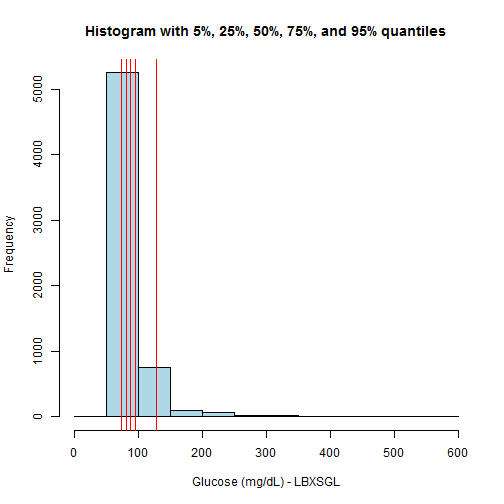

## What Is NHANES?

- The [National Health and Nutrition Examination Survey](http://www.cdc.gov/nchs/nhanes/about_nhanes.htm) is a survey conducted in the United States every other year.  It estimates health and nutrition information for the US population as a whole based on a weighted sample of about 10,000 people.

- A comprehensive set of data is made publicly available.  However, the data can be difficult to download and process.

- One common use of the NHANES data is establishing reference ranges for laboratory blood tests.

- NHANES data is also used in a wide variety of scientific studies.

---

## What Is the Purpose of NHANESApp?

- [NHANESApp](https://rseiter.shinyapps.io/NHANESApp/) is a web application developed using R and deployed using [Shiny](http://www.rstudio.com/products/shiny/).

- NHANESApp provides an easy to use and effective graphical interface to the 1999-2000 NHANES "standard" laboratory blood test data.  Two use cases are illustrated.

- Use case 1: Examine laboratory test results for their 5% and 95% quantiles (25%, 50%, and 75% are also shown) in a histogram.  These quantiles are typically used for test reference ranges and the histogram gives a perspective on the entire distribution.  Notice how the 95% level for serum glucose is close to the cutoff for diabetes.

- Use case 2: Examine scatter plots of one test result versus another.  This enables exploration of associations between test results (for example, see if serum calcium and phosphorus levels are related, note the green regression line).

- NHANESApp allows users to interactively select variables to examine.

---

## Laboratory Test Quantiles for Glucose

 

---

## Scatterplot of Serum Calcium and Phosphorus

 

<!--
---

## Conclusions

- NHANESApp provides an easy to use and effective interface to the NHANES data for examing test result distributions and associations.

- There are a variety of enhancements that would be helpful:
  - Allow specifying axes limits to focus on relevant portions of the distributions.
  - Allow specifying subsets (e.g. by age or gender).  Clinical reference ranges are often age range or gender specific.
  - Allow variable transformations (e.g. log).  This can help viewing distributions which are non-normal or have an extremely wide range.
-->
